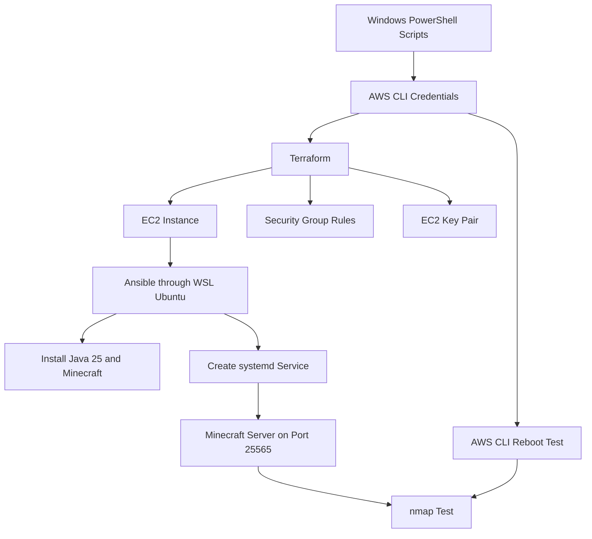

# Automated Minecraft Server Deployment on AWS

## Background

This project is a continuation of Course Project Part 1, where I manually deployed a Minecraft: Java Edition server on an AWS EC2 instance. For Part 2, I am taking that same setup and automating it with scripts. Instead of using the AWS Management Console or manually connecting to the server with SSH, this version uses infrastructure and configuration tools to build and set up the server in a way that's repeatable.

## Project Goal

The goal of this project is to automatically create the AWS resources, configure the Minecraft server, make sure the service starts again after a reboot, and verify that the server is reachable with nmap`.

This project also improves the shutdown behavior from Part 1. The server still uses systemd so it can start automatically, but it also uses mcrcon so the service can send Minecraft’s normal stop command during shutdown instead of only interrupting the Java process.

## Tools Used

I used the following tools for this project:
* Git and GitHub for version control
* AWS CLI for command-line access to AWS
* Terraform for creating the AWS infrastructure
* Ansible for configuring the EC2 instance
* PowerShell for running the project scripts from Windows
* WSL Ubuntu for running Ansible
* Nmap for testing the Minecraft server port
* systemd for managing the Minecraft service
* Eclipse Temurin Java 25 for running the Minecraft server
* mcrcon for sending a cleaner Minecraft stop command through local RCON

## Tool Versions Used

These are the versions I used while testing the project:
* Git: 2.49.0.windows.1
* AWS CLI: 2.35.1
* Terraform: 1.15.5
* Nmap: 7.99
* WSL: 2.6.1.0
* Ansible: core 2.20.1
* Python in WSL: 3.14.4

## Repository Structure

```text
minecraft-server-iac/
├── README.md
├── .gitignore
├── terraform/
│ ├── provider.tf
│ ├── main.tf
│ ├── variables.tf
│ ├── outputs.tf
│ ├── terraform.tfvars.example
│ └── .terraform.lock.hcl
├── ansible/
│ ├── playbook.yml
│ └── templates/
│ └── minecraft.service.j2
├── scripts/
│ ├── setup.ps1
│ ├── deploy.ps1
│ ├── configure.ps1
│ ├── test.ps1
│ ├── reboot-test.ps1
│ └── destroy.ps1
└── docs/
```
The Ansible inventory file isn't listed above because it's generated by configure.ps1. It's ignored by Git so the repo doesn't save local machine specs. 

## Pipeline Overview

The pipeline works as follows: 

```text
1. I run the PowerShell scripts from my Windows machine.
2. AWS CLI credentials allow the scripts and Terraform to access AWS.
3. Terraform creates the AWS infrastructure:
- EC2 instance
- security group
- EC2 key pair
- public IP output
4. The configure script creates the Ansible inventory file using Terraform output.
5. Ansible connects to the EC2 instance and configures Minecraft:
- installs Java 25
- creates the minecraft user
- creates /opt/minecraft
- downloads server.jar
- accepts the EULA
- writes server.properties
- installs mcrcon
- installs the systemd service
- enables and starts the service
6. nmap tests TCP port 25565.
7. AWS CLI reboots the EC2 instance.
8. nmap tests port 25565 again after reboot.

## Pipeline Diagram

## AWS Credentials
This project wants AWS CLI credentials to already be configured locally. Since I used AWS Academy Learner Lab, I copied the temporary AWS CLI credentials from the Learner Lab page into my local AWS credentials setup.
The AWS credentials weren't committed to GitHub.

Files that should stay local and not be committed include:
```text
.aws/
*.tfvars
*.tfstate
*.tfstate.*
private SSH keys
ansible/inventory.ini
```
The repo includes terraform.tfvars.example so someone can see what variables are needed without uploading my actual local values.

## Terraform Infrastructure
Terraform is used to create the AWS resources. The Terraform files create:
* an EC2 instance using Ubuntu Server 24.04 LTS
* a security group with:
    *  SSH on port 22 limited to my current public IP
    * Minecraft traffic on TCP port 25565 open for players/testing
* an AWS key pair using a local public SSH key
* output values for the instance ID, public IP, and nmap test command

Terraform does not configure the Minecraft software directly. It only creates the AWS infrastructure. The actual server setup is handled by Ansible after the EC2 instance exists.

## Ansible Configuration
Ansible configures the EC2 instance after Terraform creates it. The playbook installs the needed packages, installs Eclipse Temurin Java 25, creates the Minecraft user and folder, downloads the Minecraft server file, accepts the EULA, writes the server settings, installs  mcrcon, creates the systemd service, and starts the server. The Minecraft service is enabled so it starts automatically when the EC2 instance boots. The service also uses local RCON through mcrcon so Minecraft can shut down cleanly.

The RCON port is only used locally on the EC2 instance. It is not opened in the AWS security group.

## How to Run the Project
These commands should be run from the root of the repository.

### 1. Check local tools
```powershell
.\scripts\setup.ps1
```
This script checks that the main tools are installed and confirms that AWS CLI credentials are configured.

### 2. Deploy the AWS infrastructure
```powershell
.\scripts\deploy.ps1
```
This script runs Terraform. It also creates a local SSH key if one does not already exist and writes a local terraform.tfvars file using the current public IP for SSH access.

### 3. Configure the Minecraft server
```powershell
.\scripts\configure.ps1
```
This script gets the public IP from Terraform, creates the Ansible inventory file, copies the SSH key into WSL, and runs the Ansible playbook.

### 4. Test the Minecraft server
```powershell
.\scripts\test.ps1
```
This script runs an `nmap` scan against TCP port 25565.
Expected output includes something like:
```text
25565/tcp open minecraft
```
The exact Minecraft version may change depending on the current server file.

### 5. Test reboot behavior
```powershell
.\scripts\reboot-test.ps1
```
This script uses AWS CLI to reboot the EC2 instance. After the instance comes back up, it waits for Minecraft to start again and then runs nmap a second time.
Expected output after reboot includes:
```text
25565/tcp open minecraft
```
This confirms that the Minecraft service starts again automatically after reboot.

### 6. Destroy the resources when finished
```powershell
.\scripts\destroy.ps1
```
This script destroys the Terraform-created AWS resources. I would not run this before submitting or before grading is complete.

## Connecting to the Minecraft Server
This project uses the assignment’s accepted nmap testing method instead of connecting with the Minecraft client.
The test command is:
```powershell
nmap -sV -Pn -p T:25565 <instance_public_ip>
```
Terraform also prints an nmap command using the EC2 public IP so the server can be tested from the local machine. A successful result should show TCP port 25565 as open and identify the service as Minecraft.

## Testing Results
After running the Ansible configuration, I tested the server with nmap.
Example successful output:
```text
25565/tcp open minecraft Minecraft 26.1.2
Message: Stormi Automated Minecraft Server
Users: 0/20
```
I also tested the server after rebooting the EC2 instance with AWS CLI. After the reboot, nmap again showed the Minecraft service open on TCP port 25565. This confirmed that the systemd service restarted the Minecraft server automatically.

## Security Notes
This project does not commit AWS credentials, private SSH keys, Terraform state files, or real Terraform variable files.

## Resources and References
This project was not copied from one single tutorial. I used a mix of official documentation and a few examples to figure out how to connect the pieces together for this assignment.
The main structure I followed was:
•	Terraform creates the AWS infrastructure.
•	Ansible configures the EC2 instance after it exists.
•	PowerShell scripts run the project steps from Windows.
•	AWS CLI handles the reboot test without using the AWS Console.
•	nmap checks that the Minecraft server is reachable on TCP port 25565.

### Official documentation

* [Microsoft PowerShell Write-Host documentation](https://learn.microsoft.com/en-us/powershell/module/microsoft.powershell.utility/write-host?view=powershell-7.6)
* [AWS CLI configuration and credential file documentation](https://docs.aws.amazon.com/cli/latest/userguide/cli-configure-files.html)
* [AWS CLI reboot-instances documentation](https://docs.aws.amazon.com/cli/latest/reference/ec2/reboot-instances.html)
* [Amazon EC2 key pairs documentation](https://docs.aws.amazon.com/AWSEC2/latest/UserGuide/ec2-key-pairs.html)
* [Amazon EC2 security groups documentation](https://docs.aws.amazon.com/AWSEC2/latest/UserGuide/ec2-security-groups.html)
* [Terraform init command documentation](https://developer.hashicorp.com/terraform/cli/commands/init)
* [Terraform validate command documentation](https://developer.hashicorp.com/terraform/cli/commands/validate)
* [Terraform plan command documentation](https://developer.hashicorp.com/terraform/cli/commands/plan)
* [Terraform apply command documentation](https://developer.hashicorp.com/terraform/cli/commands/apply)
* [Terraform destroy command documentation](https://developer.hashicorp.com/terraform/cli/commands/destroy)
* [Terraform provider configuration documentation](https://developer.hashicorp.com/terraform/language/providers/configuration)
* [Terraform resources tutorial](https://developer.hashicorp.com/terraform/tutorials/configuration-language/resource)
* [Terraform input variables documentation](https://developer.hashicorp.com/terraform/language/values/variables)
* [Terraform outputs documentation](https://developer.hashicorp.com/terraform/language/values/outputs)
* [Terraform AWS Provider aws_instance documentation](https://registry.terraform.io/providers/hashicorp/aws/latest/docs/resources/instance)
* [Terraform AWS Provider aws_security_group documentation](https://registry.terraform.io/providers/hashicorp/aws/latest/docs/resources/security_group)
* [Terraform AWS Provider aws_key_pair documentation](https://registry.terraform.io/providers/hashicorp/aws/latest/docs/resources/key_pair)
* [Ansible apt module documentation](https://docs.ansible.com/projects/ansible/latest/collections/ansible/builtin/apt_module.html)
* [Ansible get_url module documentation](https://docs.ansible.com/projects/ansible/latest/collections/ansible/builtin/get_url_module.html)
* [Ansible apt_repository module documentation](https://docs.ansible.com/projects/ansible/latest/collections/ansible/builtin/apt_repository_module.html)
* [Ansible user module documentation](https://docs.ansible.com/projects/ansible/latest/collections/ansible/builtin/user_module.html)
* [Ansible file module documentation](https://docs.ansible.com/projects/ansible/latest/collections/ansible/builtin/file_module.html)
* [Ansible copy module documentation](https://docs.ansible.com/projects/ansible/latest/collections/ansible/builtin/copy_module.html)
* [Ansible git module documentation](https://docs.ansible.com/projects/ansible/latest/collections/ansible/builtin/git_module.html)
* [Ansible template module documentation](https://docs.ansible.com/projects/ansible/latest/collections/ansible/builtin/template_module.html)
* [Ansible systemd_service module documentation](https://docs.ansible.com/projects/ansible/latest/collections/ansible/builtin/systemd_service_module.html)
* [Official Minecraft: Java Edition server download page](https://www.minecraft.net/en-us/download/server)
* [Eclipse Adoptium Linux installation documentation](https://adoptium.net/installation/linux)
* [mcrcon GitHub repository](https://github.com/Tiiffi/mcrcon)
* [Nmap service and version detection documentation](https://nmap.org/book/man-version-detection.html)

 ## Tutorial and workflow inspiration

* [Ansible and Terraform: Better Together](https://www.hashicorp.com/en/resources/ansible-terraform-better-together)
* [How to deploy an application to AWS EC2 using Terraform and Ansible](https://dev.to/mariehposa/how-to-deploy-an-application-to-aws-ec2-instance-using-terraform-and-ansible-3e78)
* [PowerShell Write-Host color formatting example](https://evotec.xyz/blog/powershell-how-to-format-powershell-write-host-with-multiple-colors/)
