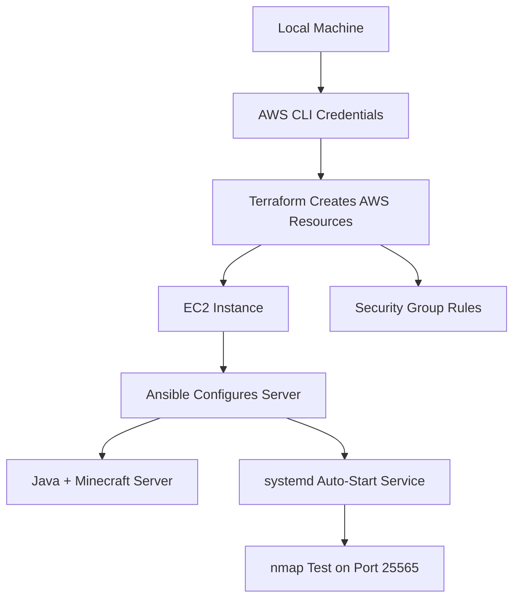

# Automated Minecraft Server Deployment on AWS

## Background

This project is a continuation of Course Project Part 1, where I manually deployed a Minecraft: Java Edition server on an AWS EC2 instance. For Part 2, I am taking that same setup and automating it with scripts. Instead of using the AWS Management Console or manually connecting to the server with SSH, this version uses infrastructure and configuration tools to build and set up the server in a way that's repeatable.

## Project Goal

The goal of this project is to automatically create the AWS resources, configure the Minecraft server, make sure the service starts again after a reboot, and verify that the server is reachable with `nmap`.

## Planned Tooling

- Git and GitHub to store and version the project files
- AWS CLI to interact with AWS from the command line
- Terraform to create the AWS infrastructure
- Ansible to configure the Minecraft server after the instance is created
- PowerShell scripts to make the pipeline easier to run from Windows
- Nmap to test that the Minecraft server port is open and reachable

## Repository Structure

```text
minecraft-server-iac/
├── README.md
├── terraform/
├── ansible/
├── scripts/
└── docs/
```

## Pipeline Overview



